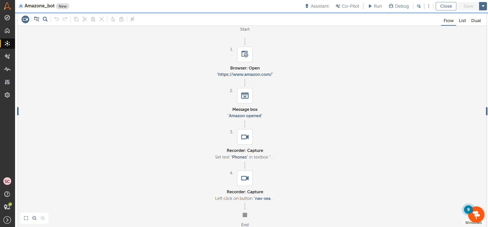

Amazon Automation Bot :  
📌 Project Overview 

This project is a browser automation bot developed using Automation Anywhere A360. 
The bot automates product search and basic interaction tasks on the Amazon website. 

The goal of this project was to practice web automation, element identification, and task execution using RPA. 

🎯 Objective 

To automate repetitive browser actions such as: 
Opening Amazon website 
Searching for a specific product 
Extracting product details 
Performing automated navigation 

🛠 Tools & Technologies Used 

Automation Anywhere A360 (Community Edition) 
Web Automation 
Browser Recorder 
Variables and Loops 
Conditional Logic 

🔄 Workflow 

Launch browser 
Navigate to Amazon website 
Enter product name in search bar 
Click search 
Extract product information (name / price / rating if implemented) 
Store data (optional: CSV or Excel) 
Close browser 

🚀 Skills Demonstrated 

Web element identification 
Browser automation 
Data extraction 
Loop implementation 
Automation workflow design 

📂 Files Included 

amazon_bot.csv – Exported bot file 
screenshot1.png – Workflow preview 

💡 Learning Outcome 

This project helped me understand real-world browser automation and how RPA tools interact with dynamic web applications. 

  

