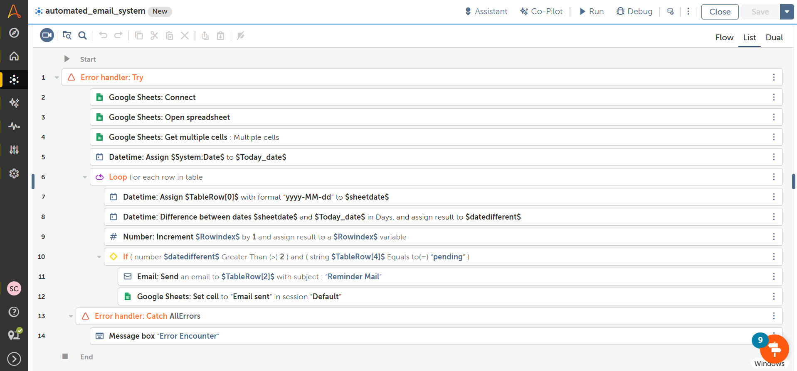

Automated Email Reminder System :  

📌 Project Overview 

This project is an RPA solution developed using Automation Anywhere A360 to automate email reminders based on data stored in Google Sheets. 
The bot checks records in a sheet, identifies pending entries based on date conditions, and automatically sends reminder emails when criteria are met. 
This project simulates a real-world business follow-up system. 

🎯 Objective 

To automate manual follow-up emails by: 
Reading data from Google Sheets 
Checking reminder status 
Calculating date differences 
Sending automated emails 
Updating the sheet after sending 

🛠 Tools & Technologies Used 

Automation Anywhere A360 (Community Edition) 
Google Sheets Integration 
Email Automation 
Date & Time Operations 
Conditional Logic 
Loops 

🔄 Workflow 

Connect to Google Sheets 
Retrieve multiple rows of data 
Loop through each record 
Check if status is "Pending" 
Calculate difference between current date and record date 
If difference exceeds defined limit (e.g., 2 days) 
Send reminder email automatically 
Update status to "Email Sent" 
Save changes 

📊 Business Logic Example 

If Status = Pending 
AND Days Difference > 2 
→ Send Email Reminder 
Otherwise → Skip Record 

🚀 Skills Demonstrated 

Data-driven automation 
API / Cloud sheet integration 
Date calculation logic 
Conditional processing 
Loop-based automation 
Process automation design 

📂 Files Included 

automated_email_system.csv – Exported bot file 
sample_sheet.xlsx – Sample Google Sheet structure 
Screenshots – Workflow preview 

💡 Learning Outcome 

This project strengthened my understanding of: 
Real-time automation scenarios 
Automating follow-up workflows 
Handling structured data 
Building practical RPA business use cases 

📸 Screenshots  

