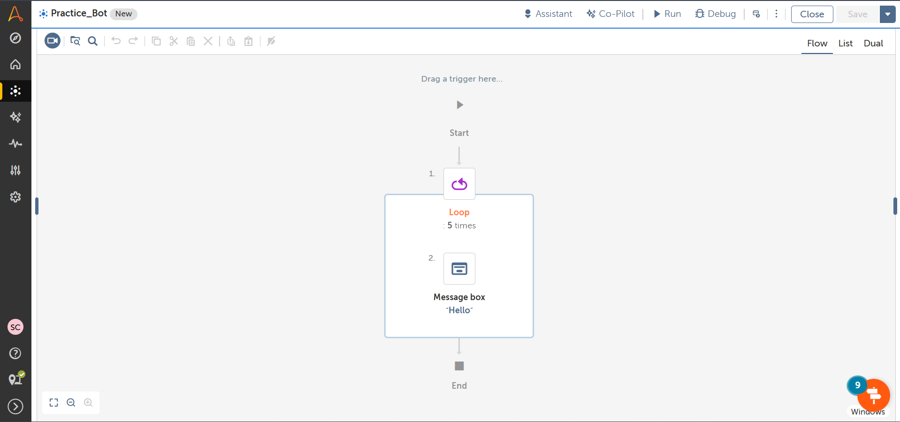

Practice Bot – Basic Automation Tasks :  

📌 Project Overview 

This project was developed using Automation Anywhere A360 to practice fundamental RPA concepts such as variables, loops, conditional statements, and message box actions. 
The goal of this bot was to strengthen core automation skills before building more advanced business workflows. 

🎯 Objective 

To understand and implement basic RPA components including: 
Variable creation and usage 
Loop execution 
Conditional logic 
Message display actions 

🛠 Tools & Technologies Used 

Automation Anywhere A360 (Community Edition) 
Variables 
If Conditions 
Loops 
Message Box 

🔄 Workflow 

Initialize variables 
Execute loop for a defined number of iterations 
Apply conditional logic inside the loop 
Display output using message box 
End execution 

🚀 Skills Demonstrated 

Basic RPA workflow creation 
Logical thinking using conditions 
Loop implementation 
Debugging and testing automation steps 

📂 Files Included 

practice_bot.csv – Exported bot file 
Screenshots – Workflow preview 

💡 Learning Outcome 

This project helped me build a strong foundation in RPA development and prepared me for creating more advanced automation projects such as Excel processing and email automation systems.

